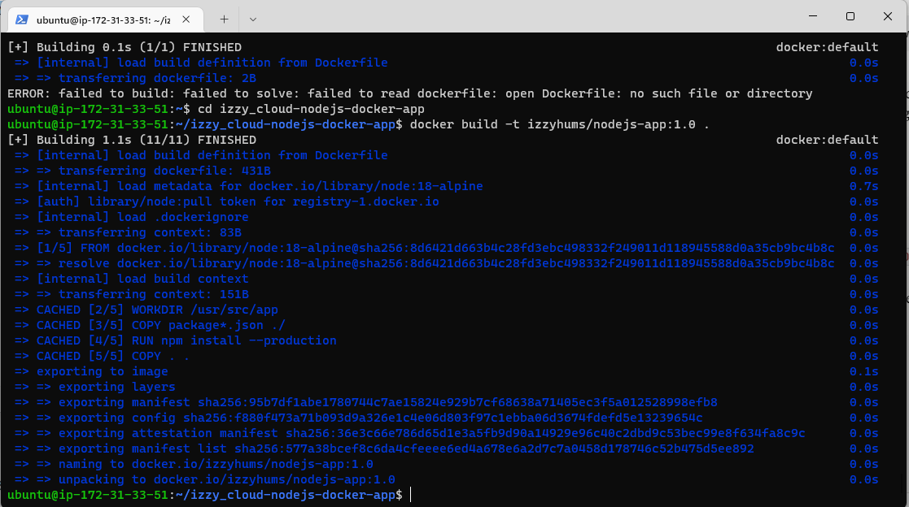
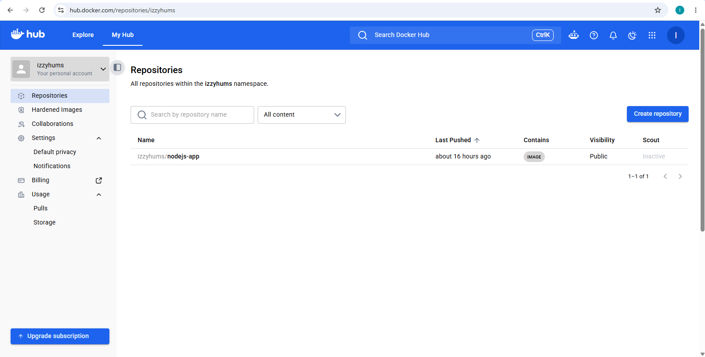
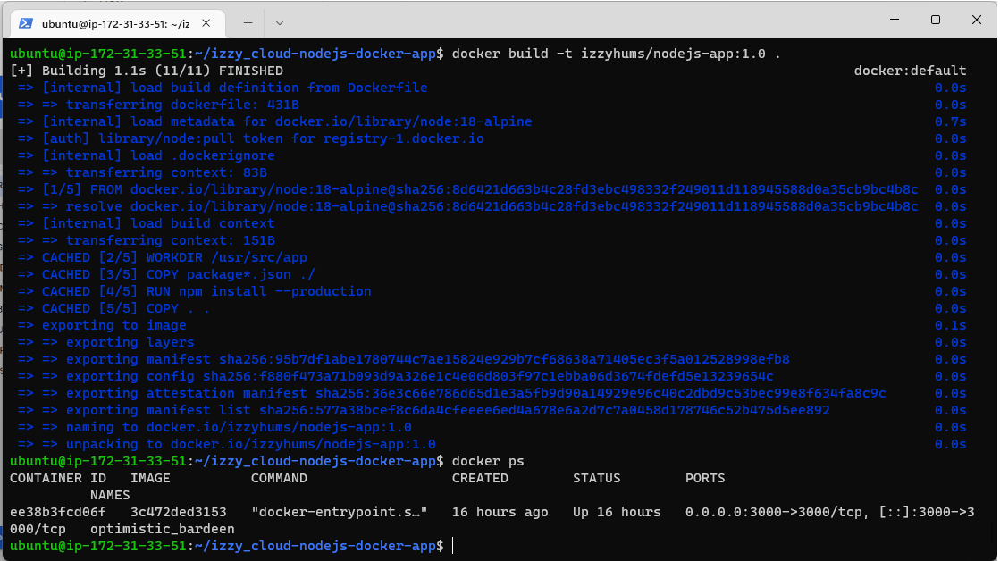
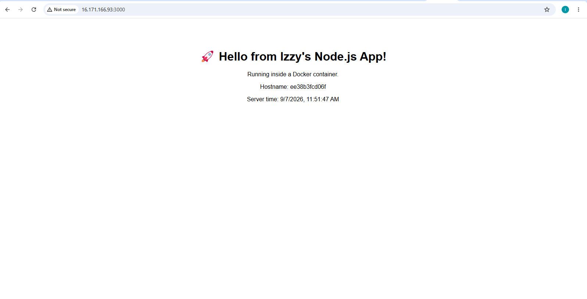

# Node.js Docker Deployment Project

A simple Node.js (Express) application, containerized with Docker and pushed to Docker Hub.

## Project Structure
- `app.js` – main application file
- `package.json` – dependencies and start script
- `Dockerfile` – instructions to build the Docker image

## How to Run Locally (without Docker)
```bash
npm install
npm start
```
Visit `http://localhost:3000`

## How to Build and Run with Docker

### 1. Build the image
```bash
docker build -t YOUR_DOCKERHUB_USERNAME/nodejs-app:1.0 .
```


### 2. Push to Docker Hub
```bash
docker login
docker push YOUR_DOCKERHUB_USERNAME/nodejs-app:1.0
```


### 3. Pull and run the container
```bash
docker pull YOUR_DOCKERHUB_USERNAME/nodejs-app:1.0
docker run -d -p 3000:3000 YOUR_DOCKERHUB_USERNAME/nodejs-app:1.0
docker ps
```


### 4. Live Application
Visit `http://YOUR_SERVER_IP:3000`



## Author
Israel Humphrey Iden (Izzy)
